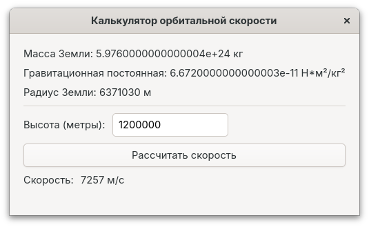

# Калькулятор орбитальной скорости

Простое приложение на GTK4, написанное на языке Vala, которое рассчитывает орбитальную скорость, необходимую для объекта на указанной высоте над поверхностью Земли.

## Описание

Это приложение рассчитывает орбитальную скорость по формуле:

```
v = √(M * G / (R + H))
```

Где:
- M = Масса Земли (5.976 × 10^24 кг)
- G = Гравитационная постоянная (6.672 × 10^-11 Н·м²/кг²)
- R = Радиус Земли (6,371,030 м)
- H = Высота над поверхностью Земли (в метрах)
- v = Орбитальная скорость (в м/с)

## Требования

- Компилятор Vala
- Библиотеки разработки GTK 4
- Система сборки Meson (рекомендуется)

## Установка зависимостей

### Ubuntu/Debian
```bash
sudo apt update
sudo apt install valac libgtk-4-dev meson build-essential
```

### Fedora
```bash
sudo dnf install vala gtk4-devel meson gcc
```

### Arch Linux
```bash
sudo pacman -S vala gtk4 meson base-devel
```

### openSUSE
```bash
sudo zypper install vala gtk4-devel meson gcc
```

## Сборка

### Использование Meson (рекомендуется)

1. Клонирование репозитория и переход в директорию проекта:
```bash
git clone https://github.com/danayer/model.git
cd /model/Model-1
```

Или создайте директорию проекта с следующими файлами:
- `main.vala` - основной код приложения
- `meson.build` - файл конфигурации сборки

2. Настройка и сборка:
```bash
meson setup builddir
cd builddir
meson compile
```

3. Запуск приложения:
```bash
./orbital-calculator
```

4. (Опционально) Установка в систему:
```bash
sudo meson install
```

### Прямая компиляция

Для быстрой сборки без системы сборки Meson:

```bash
valac --pkg gtk4 main.vala -o orbital-calculator
./orbital-calculator
```

## Использование

1. Введите высоту над поверхностью Земли в метрах
2. Нажмите кнопку "Рассчитать скорость"
3. Приложение отобразит необходимую орбитальную скорость в метрах в секунду

## Структура проекта

```
Model-1/
├── main.vala         # Основной исходный код
├── meson.build       # Файл конфигурации сборки
└── README.md         # Документация
```

## Устранение возможных проблем

### Предупреждения компиляции
При компиляции могут появляться предупреждения, такие как:
- `argument 2 of "__atomic_load" discards "volatile" qualifier`
- `"temperature_converter_properties" определена, но не используется`

Эти предупреждения безопасны и связаны с внутренней работой GTK и автоматически сгенерированным C-кодом. Они не влияют на работу приложения и их можно игнорировать. Компиляция завершится успешно, несмотря на эти предупреждения.

Если вы хотите полностью убрать эти предупреждения, можно добавить флаги компилятора в ваш meson.build:

```
c_args = [
  '-Wno-discarded-qualifiers',  // Убирает предупреждение о volatile qualifier
  '-Wno-unused-variable'        // Убирает предупреждение о неиспользуемых переменных
]

executable(
    'temperature-converter',
    'main.vala',
    dependencies: [...],
    c_args: c_args,
    install: true,
)
```

### Проблема с математическими функциями
Если при компиляции возникают ошибки вида "неопределённая ссылка на символ 'round'", это означает, что 
отсутствует ссылка на математическую библиотеку. Убедитесь, что в файле meson.build присутствует следующая строка:

```
dependencies = [
  dependency('gtk4'),
  meson.get_compiler('c').find_library('m', required: true)  # Библиотека math
]
```

### Устаревшие флаги GTK
Если компилятор выдает предупреждение о устаревших флагах (например, `G_APPLICATION_FLAGS_NONE`), 
замените их на актуальные аналоги:

```vala
// Старый вариант
Object(application_id: "...", flags: ApplicationFlags.FLAGS_NONE);

// Новый вариант
Object(application_id: "...", flags: ApplicationFlags.DEFAULT_FLAGS);
```
