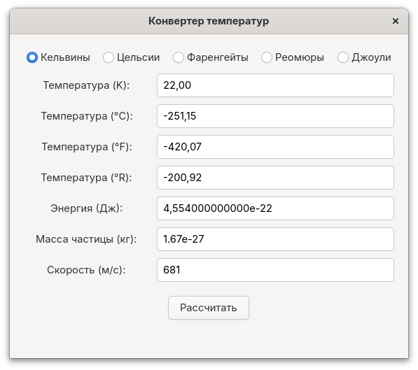

# Конвертер температур и калькулятор скорости



Приложение на GTK4, написанное на языке Vala, которое позволяет конвертировать температуру между различными шкалами и вычислять среднюю скорость частиц.

## Описание

Это приложение позволяет:
1. Конвертировать температуру между шкалами:
   - Кельвин (K)
   - Цельсий (°C)
   - Фаренгейт (°F)
   - Реомюр (°R)
   - Энергия в Джоулях (Дж)
2. Вычислять среднюю скорость частицы при данной температуре

Для вычисления скорости используется формула:
```
v = √(8kT/(πm))
```

Где:
- k = Постоянная Больцмана (1.38 × 10^-23 Дж/K)
- T = Температура в Кельвинах
- π = Число пи (3.14)
- m = Масса частицы (в кг)
- v = Средняя скорость (в м/с)

## Требования

- Компилятор Vala
- Библиотеки разработки GTK 4
- Система сборки Meson (рекомендуется)

## Установка зависимостей

### Ubuntu/Debian
```bash
sudo apt update
sudo apt install valac libgtk-4-dev meson build-essential
```

### Fedora
```bash
sudo dnf install vala gtk4-devel meson gcc
```

### Arch Linux
```bash
sudo pacman -S vala gtk4 meson base-devel
```

### openSUSE
```bash
sudo zypper install vala gtk4-devel meson gcc
```

## Сборка

### Использование Meson (рекомендуется)

1. Клонирование репозитория и переход в директорию проекта:
```bash
git clone https://github.com/danayer/model.git
cd /model/Model-2
```

Или создайте директорию проекта с следующими файлами:
- `main.vala` - основной код приложения
- `meson.build` - файл конфигурации сборки

2. Настройка и сборка:
```bash
meson setup builddir
cd builddir
meson compile
```

3. Запуск приложения:
```bash
./temperature-converter
```

4. (Опционально) Установка в систему:
```bash
sudo meson install
```

### Прямая компиляция

Для быстрой сборки без системы сборки Meson:

```bash
valac --pkg gtk4 main.vala -o temperature-converter
./temperature-converter
```

## Использование

1. Выберите шкалу температуры, с которой хотите начать (по умолчанию Кельвины)
2. Введите значение температуры в соответствующее поле
3. Введите массу частицы (по умолчанию установлена масса протона 1.67e-27 кг)
4. Нажмите кнопку "Рассчитать"
5. Приложение отобразит значения во всех шкалах и рассчитанную скорость

## Структура проекта

```
Model-2/
├── main.vala         # Основной исходный код
├── meson.build       # Файл конфигурации сборки
└── README.md         # Документация
```

## Устранение возможных проблем

### Предупреждения компиляции
При компиляции могут появляться предупреждения, такие как:
- `argument 2 of "__atomic_load" discards "volatile" qualifier`
- `"temperature_converter_properties" определена, но не используется`

Эти предупреждения безопасны и связаны с внутренней работой GTK и автоматически сгенерированным C-кодом. Они не влияют на работу приложения и их можно игнорировать. Компиляция завершится успешно, несмотря на эти предупреждения.

Если вы хотите полностью убрать эти предупреждения, можно добавить флаги компилятора в ваш meson.build:

```
c_args = [
  '-Wno-discarded-qualifiers',  // Убирает предупреждение о volatile qualifier
  '-Wno-unused-variable'        // Убирает предупреждение о неиспользуемых переменных
]

executable(
    'temperature-converter',
    'main.vala',
    dependencies: [...],
    c_args: c_args,
    install: true,
)
```

### Ошибка "unreachable catch clause detected"
Это предупреждение возникает, когда блок catch никогда не будет выполнен. В Vala метод double.parse() не выбрасывает исключение типа Error или общие исключения. Для корректной проверки ввода лучше использовать метод double.try_parse():

```vala
double value;
if (double.try_parse(input_text, out value)) {
    // ввод корректен
} else {
    // ошибка преобразования
}
```

### Ошибка при использовании set_buttons() в AlertDialog
При использовании AlertDialog в GTK4 метод set_buttons() может вызывать проблемы с типами данных. Для простого диалога с кнопкой OK лучше не использовать этот метод вообще:

```vala
var parent_window = (Gtk.Window)get_active_window();
var alert = new AlertDialog("Заголовок сообщения");
alert.set_detail("Подробный текст сообщения");
alert.set_modal(true);
alert.show(parent_window);
```

### Ошибка "The name `run' does not exist in the context of `Gtk.MessageDialog'"
Это ошибка указывает на то, что вы используете устаревший API для диалогов GTK4. Начиная с GTK 4.10, класс `MessageDialog` помечен как устаревший, а метод `run()` больше не поддерживается. Вместо этого следует использовать `AlertDialog`:

```vala
var parent_window = (Gtk.Window)get_active_window();
var alert = new AlertDialog("Заголовок сообщения");
alert.set_detail("Подробный текст сообщения");
alert.set_buttons(null);  // Отображает стандартную кнопку "OK"
alert.set_modal(true);
alert.show(parent_window);
```

### Проблема с математическими функциями
Если при компиляции возникают ошибки связанные с математическими функциями, убедитесь, что в файле meson.build присутствует следующая строка:

```
meson.get_compiler('c').find_library('m', required: true)
```

### Ошибки при вводе чисел
При вводе численных значений используйте точку в качестве десятичного разделителя, а не запятую.
Для научной нотации используйте формат, например: 1.67e-27 (масса протона в кг).
