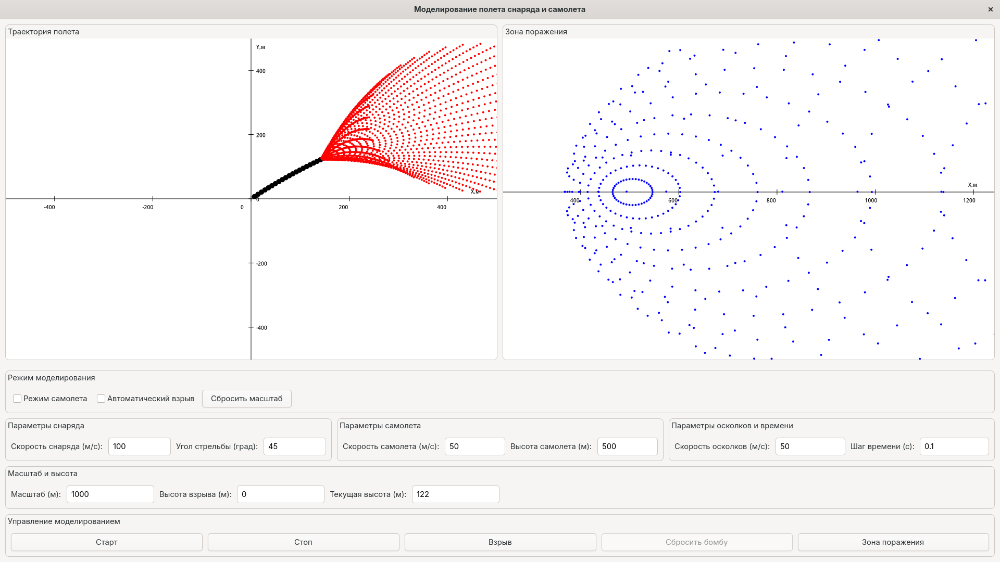

# Моделирование полета снаряда и самолета



Приложение на GTK4, написанное на языке Vala, которое моделирует полет снаряда/бомбы, самолета и визуализирует зону поражения осколками.

## Описание

Это приложение позволяет:
1. Моделировать полет артиллерийского снаряда с учетом гравитации
2. Моделировать полет самолета и сбрасываемой с него бомбы
3. Визуализировать траекторию полета на графике
4. Рассчитывать и визуализировать зону поражения осколками
5. Регулировать параметры полета (начальная скорость, угол и др.)

Для вычисления траектории используются следующие формулы:
```
x = x₀ + v₀·cos(β)·t
y = y₀ + v₀·sin(β)·t - g·t²/2
```
Где:
- x₀, y₀ - начальные координаты
- v₀ - начальная скорость
- β - угол стрельбы
- g - ускорение свободного падения (9.82 м/с²)
- t - время
- x, y - координаты снаряда в момент времени t

## Требования

- Компилятор Vala
- Библиотеки разработки GTK 4
- Система сборки Meson (рекомендуется)

## Установка зависимостей

### Ubuntu/Debian
```bash
sudo apt update
sudo apt install valac libgtk-4-dev meson build-essential
```

### Fedora
```bash
sudo dnf install vala gtk4-devel meson gcc
```

### Arch Linux
```bash
sudo pacman -S vala gtk4 meson base-devel
```

### openSUSE
```bash
sudo zypper install vala gtk4-devel meson gcc
```

## Сборка

### Использование Meson (рекомендуется)

1. Клонирование репозитория и переход в директорию проекта:
```bash
git clone https://github.com/danayer/model.git
cd /model/Model-3
```

Или создайте директорию проекта с следующими файлами:
- `main.vala` - основной код приложения
- `meson.build` - файл конфигурации сборки

2. Настройка и сборка:
```bash
meson setup builddir
cd builddir
meson compile
```

3. Запуск приложения:
```bash
./projectile-model
```

4. (Опционально) Установка в систему:
```bash
sudo meson install
```

### Прямая компиляция

Для быстрой сборки без системы сборки Meson:

```bash
valac --pkg gtk4 main.vala -o projectile-model
./projectile-model
```

## Использование

1. Выберите режим: "Снаряд" или "Самолет"
2. Введите необходимые параметры:
   - Начальная скорость (м/с)
   - Угол стрельбы (градусы) - для режима снаряда
   - Высота полета и скорость - для режима самолета
3. Нажмите кнопку "Старт" для начала моделирования
4. Используйте "Взрыв" для визуализации разлета осколков
5. Используйте "Зона поражения" для расчета и отображения радиуса поражения

## Структура проекта

```
Model-3/
├── main.vala         # Основной исходный код
├── meson.build       # Файл конфигурации сборки
└── README.md         # Документация
```

## Устранение возможных проблем

### Синтаксические особенности Vala
В отличие от C или VB.NET, в Vala нельзя объявлять несколько переменных одного типа в одной строке через запятую:

```vala
// НЕПРАВИЛЬНО - вызовет ошибку компиляции
private double x = 0, y = 0, z = 0;

// ПРАВИЛЬНО - отдельные объявления
private double x = 0;
private double y = 0;
private double z = 0;
```

### Проблемы с объектом Gdk.RGBA (цвета)
В Vala с GTK4 нельзя инициализировать Gdk.RGBA через синтаксис с фигурными скобками:

```vala
// НЕПРАВИЛЬНО - вызовет ошибку компиляции
var color = Gdk.RGBA() { red = 1.0, green = 0, blue = 0, alpha = 1.0 };

// ПРАВИЛЬНО - использование метода parse()
var color = Gdk.RGBA();
color.parse("red");    // Можно указать название цвета
// ИЛИ
color.parse("#FF0000"); // Можно указать HEX-код цвета
```

### Отсутствие библиотеки Gee
При запуске `meson compile` может возникнуть ошибка об отсутствии библиотеки `gee-0.8`. Эта библиотека используется для коллекций:

```bash
# Ubuntu/Debian
sudo apt install libgee-0.8-dev

# Fedora
sudo dnf install libgee-devel

# Arch Linux
sudo pacman -S libgee
```

### Предупреждения при компиляции
После исправления основных ошибок при компиляции могут появиться различные предупреждения. Большинство из них безопасны и не влияют на работу приложения:

1. **Неиспользуемые переменные**:
   ```
   warning: Local variable 'memory_cr' declared but never used
   warning: Field 'ProjectileModelApp.h_bumm' never used
   ```
   Можно удалить неиспользуемые переменные или добавить аннотацию `[CCode (unused = true)]` перед объявлением.

2. **Устаревшие функции**:
   ```
   warning: 'G_APPLICATION_FLAGS_NONE' устарело: Use 'G_APPLICATION_DEFAULT_FLAGS' instead
   warning: 'gtk_widget_show' устарело: Use 'gtk_widget_set_visible or gtk_window_present' instead
   ```
   Для исправления этих предупреждений обновите код:
   ```vala
   // Было
   Object(application_id: "org.gtk.projectilemodel", flags: ApplicationFlags.FLAGS_NONE);
   window.show();
   
   // Стало
   Object(application_id: "org.gtk.projectilemodel", flags: ApplicationFlags.DEFAULT_FLAGS);
   window.present();
   ```

3. **Предупреждения в автоматически сгенерированном C-коде**:
   ```
   warning: argument 2 of '__atomic_load' discards 'volatile' qualifier
   warning: 'projectile_model_app_properties' определена, но не используется
   ```

### Проблемы с отрисовкой точек
Если точки не отображаются:

1. Убедитесь, что правильно настроили масштаб координат
2. Проверьте, что метод `pix_draw` добавляет точки в коллекцию
3. Проверьте, что в методе `draw_func` правильно преобразуются координаты из реального мира в координаты экрана

```vala
// Пример правильного преобразования координат
double screen_x = width / 2 + point.x * scale_x;
double screen_y = height / 2 - point.y * scale_y; // Обратите внимание на минус, т.к. ось Y на экране направлена вниз
```

### Утечки памяти при работе с Cairo
Cairo-поверхности необходимо освобождать явно. Если приложение потребляет всё больше памяти при работе:

```vala
// Правильное освобождение ресурсов
if (saved_surface != null) {
    saved_surface.finish();
    saved_surface = null;
}
```

### Предупреждения компиляции
При компиляции могут появляться предупреждения, связанные с автоматически сгенерированным C-кодом. Эти предупреждения безопасны и не влияют на работу приложения.

### Проблемы с математическими функциями
Если при компиляции возникают ошибки, связанные с математическими функциями, убедитесь, что в файле meson.build присутствует следующая строка:

```
meson.get_compiler('c').find_library('m', required: true)
```

### Ошибки при вводе чисел
При вводе численных значений используйте точку в качестве десятичного разделителя, а не запятую.

### Проблемы с отображением графики
Если график не отображается корректно, убедитесь, что размеры окна достаточны для отображения всех элементов интерфейса.

### Отсутствие объявления переменных
При компиляции может возникнуть ошибка с сообщением вида:
```
error: variable 'x' is not declared
```
Убедитесь, что все переменные объявлены перед их использованием.

### Предупреждения о неиспользуемых переменных и аннотациях

При компиляции могут появляться предупреждения о неиспользуемых переменных вида:
```
warning: Local variable 'memory_cr' declared but never used
warning: Field 'ProjectileModelApp.h_bumm' never used
```
Можно удалить неиспользуемые переменные или добавить аннотацию `[CCode (unused = true)]` перед объявлением.
