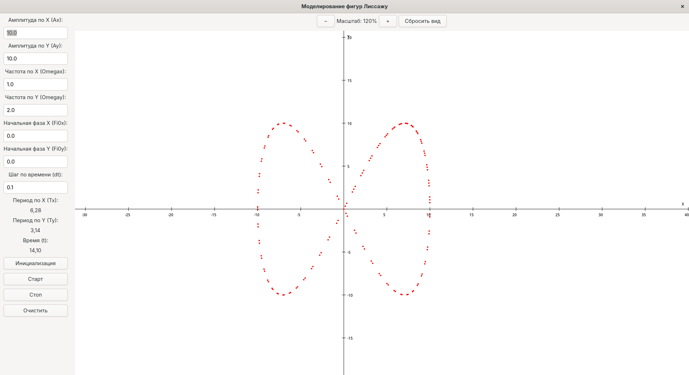

# Моделирование фигур Лиссажу



Приложение на GTK4, написанное на языке Vala, которое моделирует фигуры Лиссажу для визуализации сложения двух гармонических колебаний.

## Описание

Это приложение позволяет:
1. Моделировать фигуры Лиссажу с разными параметрами
2. Настраивать амплитуды, частоты и начальные фазы по осям X и Y
3. Визуализировать траекторию движения точки во времени
4. Регулировать шаг времени для изменения скорости построения
5. Наблюдать построение фигур в реальном времени
6. Масштабировать график (колесом мыши или кнопками "+" и "-")
7. Перемещаться по графику (перетаскиванием мыши)

Для вычисления траектории используются следующие формулы:
```
x = Ax·sin(Omegax·t + Fi0x)
y = Ay·sin(Omegay·t + Fi0y)
```
Где:
- Ax, Ay - амплитуды колебаний по осям X и Y
- Omegax, Omegay - угловые частоты колебаний
- Fi0x, Fi0y - начальные фазы колебаний
- t - время
- x, y - координаты точки в момент времени t

## Требования

- Компилятор Vala
- Библиотеки разработки GTK 4
- Библиотека Gee для работы с коллекциями
- Система сборки Meson (рекомендуется)

## Установка зависимостей

### Ubuntu/Debian
```bash
sudo apt update
sudo apt install valac libgtk-4-dev libgee-0.8-dev meson build-essential
```

### Fedora
```bash
sudo dnf install vala gtk4-devel libgee-devel meson gcc
```

### Arch Linux
```bash
sudo pacman -S vala gtk4 libgee meson base-devel
```

### openSUSE
```bash
sudo zypper install vala gtk4-devel libgee-devel meson gcc
```

## Сборка

### Использование Meson (рекомендуется)

1. Клонирование репозитория и переход в директорию проекта:
```bash
git clone https://github.com/danayer/model.git
cd /model/Model-4
```

Или создайте директорию проекта с следующими файлами:
- `main.vala` - основной код приложения
- `meson.build` - файл конфигурации сборки

2. Настройка и сборка:
```bash
meson setup builddir
cd builddir
meson compile
```

3. Запуск приложения:
```bash
./lissajous-model
```

4. (Опционально) Установка в систему:
```bash
sudo meson install
```

### Прямая компиляция

Для быстрой сборки без системы сборки Meson:

```bash
valac --pkg gtk4 --pkg gee-0.8 main.vala -o lissajous-model -X -lm
./lissajous-model
```

## Использование

1. Введите параметры фигуры Лиссажу:
   - Амплитуда по оси X (Ax)
   - Амплитуда по оси Y (Ay)
   - Угловая частота по оси X (Omegax)
   - Угловая частота по оси Y (Omegay)
   - Начальная фаза по оси X (Fi0x)
   - Начальная фаза по оси Y (Fi0y)
   - Шаг по времени (dt)
2. Нажмите "Инициализация" для применения параметров
3. Нажмите "Старт" для начала моделирования
4. Используйте "Стоп" для приостановки и "Очистить" для сброса

### Навигация по графику
- **Увеличение/уменьшение масштаба:**
  - Прокрутка колеса мыши
  - Кнопки "+" и "-" в верхней части графика
- **Перемещение по графику:**
  - Удерживайте левую кнопку мыши и перетаскивайте
- **Сброс вида:**
  - Кнопка "Сбросить вид" возвращает масштаб и позицию к исходным значениям

## Структура проекта

```
Model-4/
├── main.vala         # Основной исходный код
├── meson.build       # Файл конфигурации сборки
└── README.md         # Документация
```

## Теоретическая справка

Фигуры Лиссажу возникают при сложении двух гармонических колебаний, направленных вдоль перпендикулярных осей. Форма фигуры зависит от соотношения частот Omegax и Omegay.

При соотношении частот в виде рациональной дроби m/n (где m и n - целые числа) фигура Лиссажу представляет собой замкнутую кривую. Например:
- При Omegax = Omegay фигура - окружность или эллипс (в зависимости от разности фаз и амплитуд)
- При Omegax = 2·Omegay фигура напоминает "восьмерку"
- При Omegax = 3·Omegay фигура имеет три петли

## Устранение возможных проблем

### Синтаксические особенности Vala
В Vala нельзя объявлять несколько переменных одного типа в одной строке через запятую:

```vala
// НЕПРАВИЛЬНО - вызовет ошибку компиляции
private double x = 0, y = 0, z = 0;

// ПРАВИЛЬНО - отдельные объявления
private double x = 0;
private double y = 0;
private double z = 0;
```

### Проблемы с объектом Gdk.RGBA (цвета)
В Vala с GTK4 для инициализации Gdk.RGBA следует использовать метод parse():

```vala
// ПРАВИЛЬНО - использование метода parse()
var color = Gdk.RGBA();
color.parse("red");    // Можно указать название цвета
// ИЛИ
color.parse("#FF0000"); // Можно указать HEX-код цвета
```

### Отсутствие библиотеки Gee
Если при запуске `meson compile` возникает ошибка об отсутствии библиотеки `gee-0.8`, установите её:

```bash
# Ubuntu/Debian
sudo apt install libgee-0.8-dev

# Fedora
sudo dnf install libgee-devel

# Arch Linux
sudo pacman -S libgee
```

### Ошибки с математическими функциями
Если при компиляции возникают ошибки, связанные с математическими функциями, убедитесь, что в файл meson.build добавлена строка:

```
math_lib = meson.get_compiler('c').find_library('m', required: true)
```

И что математическая библиотека включена в зависимости:

```
dependencies: dependencies + [math_lib],
```

### Проблемы с отображением графики
Если график не отображается корректно, проверьте:
1. Корректность введенных параметров
2. Достаточный размер области рисования 
3. Правильность масштабирования (переменная scale_factor)

### Ошибки при вводе чисел
При вводе численных значений используйте точку в качестве десятичного разделителя, а не запятую.

### Предупреждения при компиляции
При компиляции могут появляться предупреждения, связанные с автоматически сгенерированным C-кодом. Эти предупреждения безопасны и не влияют на работу приложения. Типичные предупреждения включают:
```
warning: argument 2 of «__atomic_load» discards «volatile» qualifier [-Wdiscarded-qualifiers]
warning: «lissajous_app_properties» определена, но не используется [-Wunused-variable]
```

Для игнорирования этих предупреждений в файле meson.build добавлены специальные флаги компилятора:
```python
c_args += ['-Wno-discarded-qualifiers']  # Игнорировать предупреждения о volatile qualifier
c_args += ['-Wno-unused-variable']       # Игнорировать предупреждения о неиспользуемых переменных
```

Таким образом, при сборке проекта через `meson compile` эти предупреждения не будут отображаться.

### Масштабирование и перемещение по графику
Если не работают функции масштабирования и перемещения:
1. Проверьте версию GTK4 - требуется как минимум 4.0
2. Убедитесь, что события мыши корректно обрабатываются
3. Проверьте правильность обработки смещений и масштаба в функции рисования
